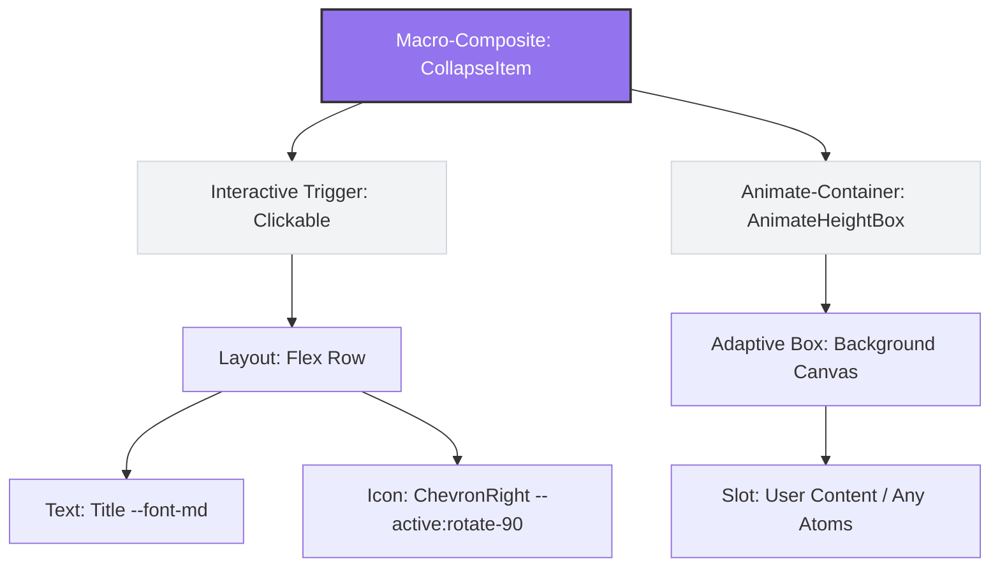

## AI Coding 专属：全系统原子化解构蓝图

### 层次总览 (The Layering Architecture)

- Foundations (基石 Token)：颜色、间距、排版、高程（无实质 DOM，仅作为属性附着）
- Primitives / Atoms (原子件)：不可再分的最小实质 HTML 容器或节点
- Micro-Composites (微复合件)：由原子件直接组合而成的基础控制件（如 Button, Input）
- Macro-Composites (宏复合件)：通过拼装宪法生成的业务区块（如 Collapse, Card, Dropdown）

### 1. 全系统核心原子件 (The Primitives / Atoms)

原子件是 AI 拼装世界里的最高硬度砖块。任何一个原子件，其内部禁止再嵌套另一个同类或更高级别的组件。整个 SaaS 系统只需要以下 5 大类原子件 即可穷尽所有视觉场景：

#### 1.1 容器类原子 (Containers)

负责承载物理世界中的“空间与高程”，是万物的底座

- Box (基础块容器)：对应 div，唯一的职责是提供背景色（自适应吸附色）和圆角
- Flex / Grid (弹性/网格容器)：纯几何排版控制件，没有任何皮肤色，只负责定义内部子元素的排列方向、对齐方式以及刚性间距（Gap）
- Mask / Overlay (遮罩原子)：高景深控制件，负责全屏调暗或局部毛玻璃遮挡

#### 1.2 文本类原子 (Typography)

负责将文字排版系统落地

- Text (行内/块级文本)：包裹文字的最小单元。通过绑定 --font-md 等 Token，强行锁死行高与字间距，防止文字单靠自身撑开父级容器

#### 1.3 媒体类原子 (Media)

- Icon (图标原子)：严格固定宽高比（如 1:1）的 SVG 载体。它没有点击事件，只有自身的颜色吸附（跟随文本颜色 currentColor）
- Image / Avatar (图像原子)：处理图片裁剪、占位与默认骨架屏流光的原子壳

#### 1.4 微动作触发原子 (Interactive Triggers)

这是最关键的解耦！把“可点击的物理行为”从按钮、菜单项中剥离出来

- Clickable (点击物理层)：一个隐形的包裹件（Hitbox）。它没有任何样式，但它向 AI 提供通用的 Hover/Active 触感动力学（如悬停加深 5%、点击缩放 scale(0.98)）
- Scrollable (滚动视窗原子)：专门处理高密度数据产生截断时的物理滚动条（原生滚动条美化）

#### 1.5 状态反馈原子 (Feedback Shards)

这是最关键的解耦！把“可点击的物理行为”从按钮、菜单项中剥离出来

- Badge Dot (状态徽标点)：绝对定位的提示红点
- Skeleton Line (骨架流光条)：绑定了 semantic-skeleton-shimmer 渐变的动态占位件

### 2. 它是如何通过“原子”拼出“复合件”的？(AI 组装示例)

当你想让 AI 帮你写一个你认为的“复合件”时，AI 的大脑里不需要调用特定的大组件代码，而是进行以下“化学方程式式”的聚合：

#### 2.1 聚合公式一：标准 Button (微复合件)

- **Micro-Composite**: `Button`
  - **Wrapper/Interactive Layer**: `Clickable` (点击触发原子，赋予 Hover/Active 触感与高程底色自适应)
    - **Layout Container**: `Flex` (几何排版原子，配置：`row`, `items-center`, `justify-center`, `gap-space-sm`)
      - **Content Leaf 1**: `Icon` (图标原子，属性：`font-size-match`, `color-currentColor`)
      - **Content Leaf 2**: `Text` (文本原子，变量：`--font-sm`, `font-weight: 500`)

AI 自适应加持：当这个 Button 放在 Sidebar 还是 Canvas 上，外层的 Clickable 会自动读取宿主高程，赋予其正确的环境吸附底色，直接免去了写 type="secondary" 的参数负担

#### 2.2 聚合公式二：标准 Input (微复合件)

| 嵌套图层 (Layer Depth) | 对应物理原子 (Primitive Atom) | 绑定设计基石 (Foundation Tokens) / 核心控制属性 |
| :-- | :-- | :-- |
| **层级 1 (外壳底座)** | `Box` (基础块容器) | `border: 1px solid var(--color-hairline-subtle)`, `radius: var(--radius-md)` |
| **层级 2 (布局中轴)** | `Flex` (弹性容器) | `direction: row`, `align: center`, `padding-x: var(--space-md)`, `gap: var(--space-xs)` |
| **层级 3 (左插槽)** | `Icon` (图标原子) | `size: var(--icon-sm)`, `color: var(--color-text-muted)` |
| **层级 3 (中核输入)** | `tag-native-input` (原生节点) | `background: transparent`, `outline: none`, `typography: var(--font-md)` |
| **层级 3 (右动作)** | `Clickable` (微动作原子) | `trigger: onClick(clear)`, `hover: rgba(0,0,0,0.04)` |
| └── _子节点_ | `Icon` (关闭叉号) | `asset: ChevronClose`, `color: var(--color-text-placeholder)` |

#### 2.3 聚合公式三：Collapse 折叠面板 (宏复合件)

### 💡 针对 AI 喂养的最终决定：

如果你在重构你的大总纲 `DESIGN.md`：

1. **频繁使用的常规组合**（如按钮、输入框），直接用 **方案一（无序列表）**，保持文档极致精简，AI 扫描上下文（Chunk）时的 Token 消耗最低，且绝对不会错位。
2. **需要死锁微观核心数据的组合**（如带有各种高程、边框合并逻辑的复杂栏目），用 **方案二（刚性表格）**。
3. 如果你想直接在本地或 Cursor 的 Preview 窗口里直观检视整个系统的乐高组装生态，用 **方案三（Mermaid）**。

### 3 设计师的战略转向

既然你已经开启了这个高维构想，你就不需要再去为每一个具体的业务组件（如 Tabs、Breadcrumb、Collapse、Alert）去写长篇大论的样式规范了。你只需要维护好以下 三大核心军规：

- 完善组件基石 (Design Foundations)：把你之前的颜色（高程自适应）、间距（Gap 步长）、排版（中英文防错位）做成绝对死锁的全局变量
- 定义原子件的“微观边界宪法”：比如写死 Clickable 在亮色模式下 Hover 必须是 rgba(0,0,0,0.04) 的物理吸附叠层；写死 Box 的圆角嵌套公式（$$Radius_{\text{inner}} = Radius_{\text{outer}} - \text{Padding}$$）
- 在 .cursorrules 中写死“合规判定”：告诉 AI，禁止使用任何非原子件拼凑界面，写出 className="h-\[40px\]" 这种脏代码直接判定为重构失败